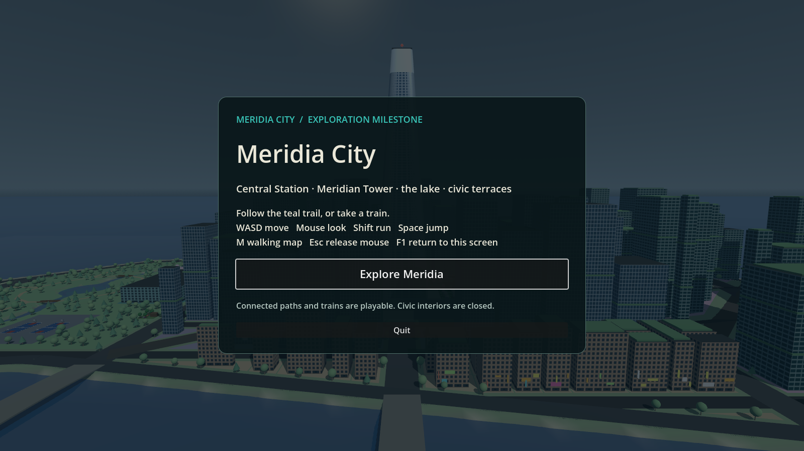

# Meridia City — exploration milestone

The connected exploration milestone is complete: Central Station and its four
train journeys, the signed route over Core Bridge to Meridian Tower, museum
terrace, lake loop with two footbridges, and library terrace. A live walking map,
launch screen and staged loading make that slice accessible. Civic interiors and
unmarked city districts remain outside this milestone.

## Play

Extract the entire portable Windows ZIP and double-click **Play Meridia.cmd**.
It includes the Godot 4.7.2 runtime; a separate Godot installation is unnecessary.
The package uses Forward+ and needs a Vulkan-capable Windows 64-bit machine.
Choose **Explore Meridia** on the launch screen.

| Control | Action |
| --- | --- |
| WASD / mouse | Walk / look |
| Shift / Space | Run / jump |
| M | Open or close the walking map |
| Esc / click | Release or recapture the mouse |
| F1 | Return to the launch screen |
| Train destination panel | Choose a stop by clicking or pressing its number |

In the repository, open `walk/Meridia.tscn` and run the current scene (F6), or run
`godot --path . res://walk/Meridia.tscn`. The original gunslinger main scene is
preserved. `walk/StationWalk.tscn` still supports direct exploration.

## Loading and cached geometry

The launch screen renders before city construction starts. Progress updates
between terrain, streets, architecture, station and traversal stages; the walker
and train UI become available only after generation completes. F1 returns to the
launch screen once exploration is ready.

Compressed terrain and road meshes are shipped under `data/meridia_cache`.
A digest of layout data, generating scripts and engine version invalidates them
automatically. Stale or missing cache files fall back to generation. After edits,
run `godot --headless --path . --script res://tools/bake_meridia_meshes.gd` to refresh.
`MERIDIA_REBUILD=1` bypasses caching for diagnosis. Cache equivalence is tested
against freshly generated vertices, normals, indices and vertex colors.

The final GPU profile observed 4.60 seconds of viewer construction, versus 5.76
seconds in the preceding run (about 20% less). Startup remains multi-second;
progress yields between stages, rather than moving generation to another thread.
The worst sampled P95 frame time was 6.75 ms on the RTX 3080. See
`meridia-performance-release.json` and `meridia-performance.md` for measurements
and their limits.

## Verification

- Launch, loading stages, exploration readiness and F1 return: passed.
- Connected station–museum–lake–library–station walk: passed, 1,030 simulated seconds.
- All four train journeys: passed (east, west, tower, park).
- Station tour including balcony and stair systems: passed.
- Cached terrain/roads match fresh geometry; cache bypass: passed.
- Generated-city smoke checks: passed.
- Packaged runtime launched its own project and completed loading: passed.
- Launch screen and walking UI rendered and reviewed on the real Vulkan renderer.

## Rebuild the portable package

Import with Godot 4.7.2 first so script registration and artwork imports exist.
Generate runtime license files, then run the packaging script from PowerShell:

```powershell
$env:LICENSE_OUT = (Resolve-Path tests/out).Path
godot --headless --path . --script res://tools/runtime_licenses.gd
./tools/package_meridia.ps1 -EnginePath 'C:/path/to/Godot_v4.7.2-stable_win64.exe' -OutputDirectory 'tests/out/Meridia-Windows'
```

Choose an unused output directory; existing packages are preserved. The script
bundles project sources, cached meshes, import data, the Windows Godot runtime,
runtime license text and third-party attribution. It creates a ZIP and prints its
SHA-256 digest. This is a portable source/runtime bundle, not a template-based
Godot export. Godot export templates were unavailable on the build machine.


